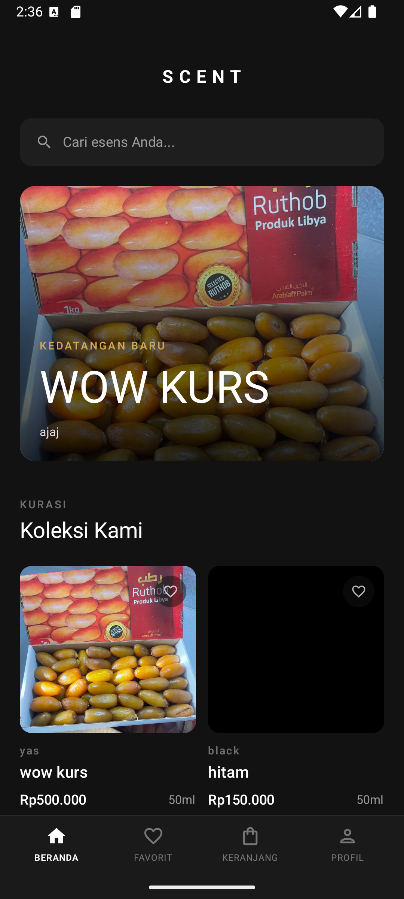
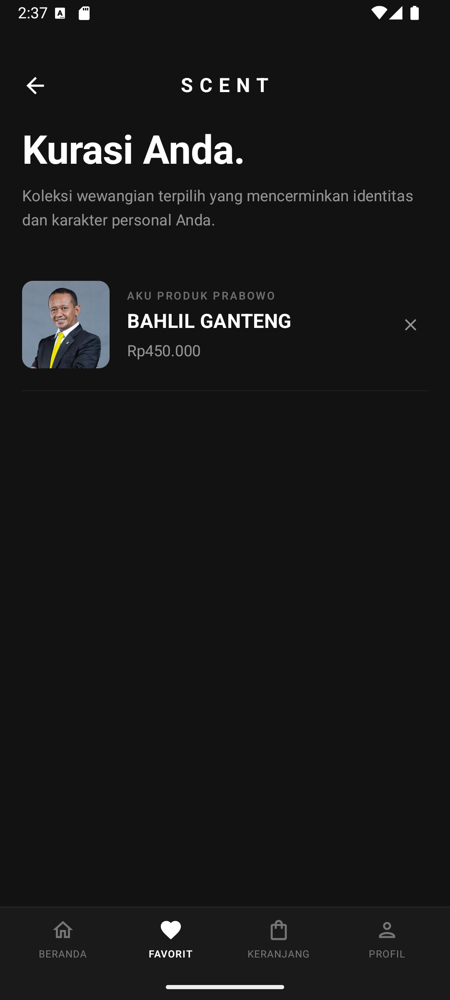
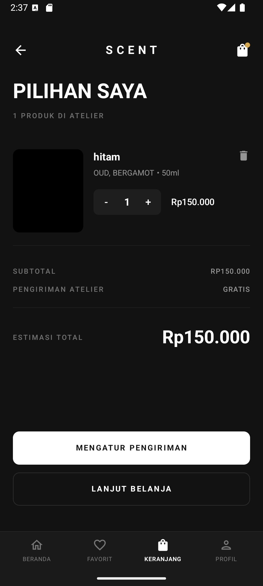
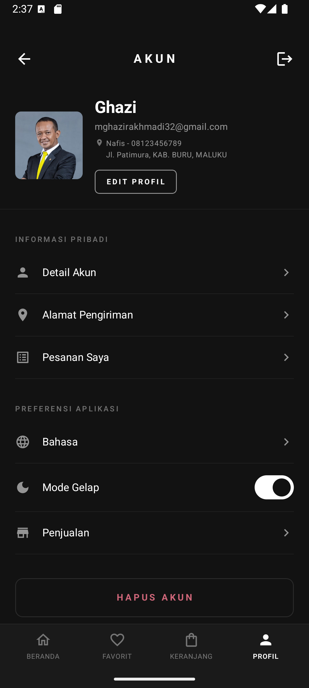
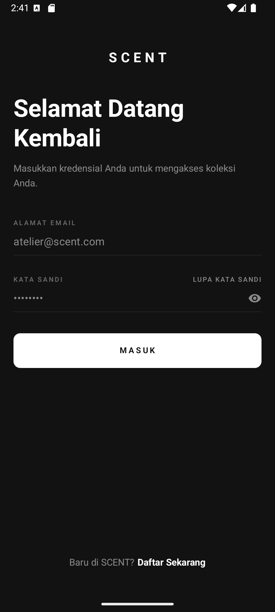

# ScentApp - E-Commerce Parfum (Android)

ScentApp adalah aplikasi *e-commerce* berbasis Android yang didesain khusus untuk komunitas pecinta parfum. Aplikasi ini menyediakan fitur katalog, pencarian spesifik berdasarkan *notes* parfum, keranjang belanja, manajemen pesanan (pembeli & penjual), dan pelacakan pengiriman secara langsung.

> **Repository:** [https://github.com/MuhammadNafisPutra/SCENT](https://github.com/MuhammadNafisPutra/SCENT)

---

## 📸 Screenshot Aplikasi

### Halaman Utama

| Beranda | Beranda Mode Terang | Beranda Horizontal |
|:---:|:---:|:---:|
|  |  |  |

### Produk

| Detail Produk Mode Terang | Edit Produk | Favorit |
|:---:|:---:|:---:|
|  |  |  |

### Pencarian & Filter

| Filter Mode Terang | Pencarian Mode Terang |
|:---:|:---:|
|  |  |

### Transaksi & Keranjang

| Keranjang | Konfirmasi Pembayaran | Konfirmasi Pembayaran Bank |
|:---:|:---:|:---:|
|  |  |  |

### Penjual & Pengiriman

| Halaman Penjualan | Halaman Pengiriman | Memberikan Ulasan |
|:---:|:---:|:---:|
|  |  |  |

### Profil & Akun

| Profile | Halaman Detail Profile | Login |
|:---:|:---:|:---:|
|  |  |  |

### Pengaturan

| Halaman Alamat | Halaman Bahasa |
|:---:|:---:|
|  |  |

---

##  Penjelasan Fitur

### Fitur Wajib (Core Features)

1. **Daftar/Data (BREAD):**
    - *Browse/Read:* Menelusuri katalog parfum (Home) dan melihat detail produk.
    - *Edit/Add/Delete:* Menambah/mengubah/menghapus parfum di keranjang, menambah produk toko (penjual), dan menulis ulasan.

2. **Koneksi API Pihak Ketiga:** Integrasi dengan API eksternal (BinderByte & Cloudinary).

3. **Database Lokal (Room):** Penyimpanan riwayat pencarian (*Search History*) dan keranjang belanja (*Cart*) agar aplikasi tetap cepat.

4. **Clean Architecture:** Pembagian struktur kode menjadi `data`, `domain`, dan `ui` untuk skalabilitas.

5. **MVVM (Model-View-ViewModel):** Pemisahan logika bisnis (ViewModel) dan tampilan antarmuka (Jetpack Compose).

### Fitur Tambahan (Nilai Plus)

1. **Real-time Data Update:** Menggunakan Firebase Firestore dengan *Snapshot Listener* sehingga perubahan stok atau status pesanan langsung berubah di layar tanpa perlu *refresh* halaman.

2. **Local Database Caching Strategy:** Menggunakan *Room Database* untuk menyimpan *cache* pencarian dan data *Cart* sementara untuk efisiensi jaringan.

3. **Manual Dependency Injection:** Implementasi DI manual yang bersih menggunakan `ViewModelFactory` dan `AppContainer` tanpa menggunakan *library* berat seperti Hilt/Dagger.

4. **Third-party File Upload API:** Menggunakan **Cloudinary API** untuk mengunggah dan menyimpan foto bukti transfer dan gambar produk (bukan menyimpan *Base64* string yang memberatkan database).

---

## 🛠 Informasi API yang Digunakan

| No | API | Kegunaan |
|---|---|---|
| 1 | **Firebase Authentication** | Autentikasi pengguna dengan Email/Password |
| 2 | **Firebase Firestore** | Backend-as-a-Service (BaaS) *real-time* NoSQL untuk menyimpan dan menyinkronkan data produk, pesanan, dan pengguna |
| 3 | **BinderByte API** | Pelacakan nomor resi logistik secara *real-time* via HTTP request menggunakan `Retrofit` |
| 4 | **Cloudinary API** | *Image hosting* pihak ketiga; aplikasi mengirim gambar via *Multipart Request* secara langsung (unsigned) untuk mendapatkan URL gambar (*secure_url*) |

---

##  Struktur Folder

```
SCENT/
├── app/
│   ├── src/
│   │   └── main/
│   │       ├── java/com/example/scent/
│   │       │   ├── data/                   # Layer Data
│   │       │   │   ├── local/              # Room Database (DAO, Entity)
│   │       │   │   │   ├── dao/            # Data Access Objects
│   │       │   │   │   └── entity/         # Room Entity classes
│   │       │   │   ├── remote/             # Sumber data jarak jauh
│   │       │   │   │   ├── firebase/       # Firebase Firestore & Auth
│   │       │   │   │   ├── retrofit/       # Retrofit Service (BinderByte)
│   │       │   │   │   └── cloudinary/     # Cloudinary Uploader
│   │       │   │   └── repository/         # Implementasi Repository
│   │       │   ├── domain/                 # Layer Domain
│   │       │   │   ├── model/              # Data class utama (Model)
│   │       │   │   ├── repository/         # Antarmuka Repository
│   │       │   │   └── usecase/            # Use Case (logika bisnis)
│   │       │   ├── ui/                     # Layer UI (Jetpack Compose)
│   │       │   │   ├── screen/             # Halaman-halaman Compose (Screen)
│   │       │   │   │   ├── home/
│   │       │   │   │   ├── product/
│   │       │   │   │   ├── cart/
│   │       │   │   │   ├── order/
│   │       │   │   │   ├── profile/
│   │       │   │   │   └── auth/
│   │       │   │   ├── navigation/         # Navigasi antar halaman
│   │       │   │   ├── viewmodel/          # ViewModel (StateFlow)
│   │       │   │   └── theme/              # Tema & styling aplikasi
│   │       │   └── di/                     # Dependency Injection Manual
│   │       │       └── AppContainer.kt     # Container & ViewModelFactory
│   │       └── res/                        # Resource (drawable, values, dll.)
│   ├── google-services.json                # (diabaikan di Git - tambahkan manual)
│   └── build.gradle
├── docs/                                   # Screenshot & dokumentasi
├── gradle/
├── build.gradle
└── README.md
```

---

## Arsitektur Aplikasi

Aplikasi ini dibangun menggunakan pola **Clean Architecture** yang dikombinasikan dengan pola presentasi **MVVM (Model-View-ViewModel)**. Tampilan antarmuka (UI) dikembangkan sepenuhnya menggunakan **Jetpack Compose** (Declarative UI).

```
┌──────────────────────────────────────────┐
│               UI Layer                   │
│   Jetpack Compose Screen + ViewModel     │
│           (StateFlow)                    │
└────────────────┬─────────────────────────┘
                 │ calls
┌────────────────▼─────────────────────────┐
│             Domain Layer                 │
│       Use Case + Repository Interface    │
│            + Data Model                  │
└────────────────┬─────────────────────────┘
                 │ implements
┌────────────────▼─────────────────────────┐
│              Data Layer                  │
│  Room (Local) │ Firebase │ Retrofit      │
│               │          │ Cloudinary    │
└──────────────────────────────────────────┘
```

- `data/` — Implementasi repositori, sumber data lokal (Room DAO), dan sumber data jarak jauh (Retrofit Service, Cloudinary Uploader, Firebase).
- `domain/` — Use Case, model data class utama, dan antarmuka Repository.
- `ui/` — Halaman Jetpack Compose (`Screen`), navigasi, dan ViewModel yang mengatur StateFlow.
- `di/` — AppContainer untuk Dependency Injection manual.

---

## Cara Instalasi

1. *Clone* repository ini ke komputer lokal Anda:
   ```bash
   git clone https://github.com/MuhammadNafisPutra/SCENT.git
   ```

2. Buka proyek menggunakan **Android Studio** (disarankan versi terbaru yang mendukung Jetpack Compose dan Gradle 8+).

3. Tunggu hingga proses *Gradle Sync* selesai secara otomatis.

4. Pastikan Anda memiliki file `google-services.json` dari Firebase Console dan letakkan di dalam direktori `app/`.
   > ⚠️ *Catatan: File ini sengaja diabaikan di Git (`.gitignore`) untuk keamanan. Hubungi pengembang untuk mendapatkan file ini.*

5. Pastikan koneksi internet tersedia agar Firebase dan API pihak ketiga dapat diakses.

---

## ▶️ Cara Menjalankan Aplikasi

1. Sambungkan perangkat Android fisik via kabel USB (aktifkan **USB Debugging** di *Developer Options*), atau jalankan *Android Virtual Device (Emulator)* melalui Android Studio.

2. Klik tombol **"Run 'app'"** (ikon segitiga hijau ▶) di toolbar atas Android Studio, atau gunakan *shortcut*:
   ```
   Shift + F10
   ```

3. Aplikasi akan di-*compile* dan langsung terbuka di perangkat/emulator Anda.

---

## Teknologi & Library yang Digunakan

| Kategori | Teknologi |
|---|---|
| Bahasa | Kotlin |
| UI Framework | Jetpack Compose |
| Arsitektur | Clean Architecture + MVVM |
| Database Lokal | Room Database |
| Backend | Firebase Firestore & Authentication |
| Networking | Retrofit + OkHttp |
| Image Hosting | Cloudinary API |
| Tracking Logistik | BinderByte API |
| Dependency Injection | Manual (AppContainer + ViewModelFactory) |
| Async | Kotlin Coroutines + StateFlow |

---

## 👨‍💻 Developer
**Muhammad Ghazi Rakhmadi**
- GitHub: [@MuhammadGhaziRakhmadi](https://github.com/muh-ghazii)

**Muhammad Nafis Putra**
- GitHub: [@MuhammadNafisPutra](https://github.com/MuhammadNafisPutra)
